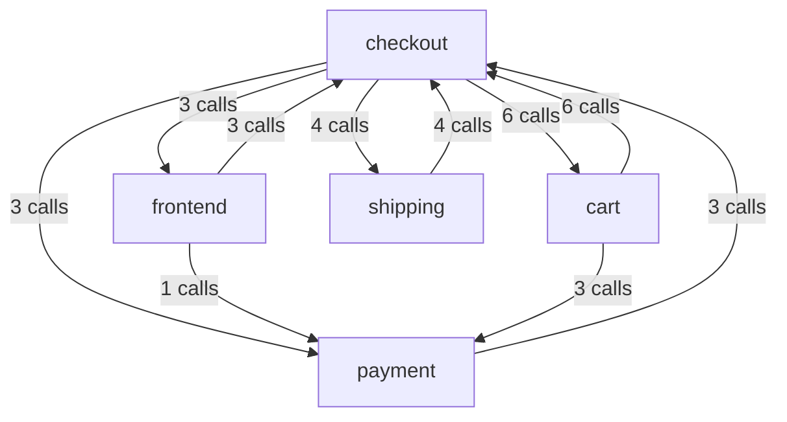
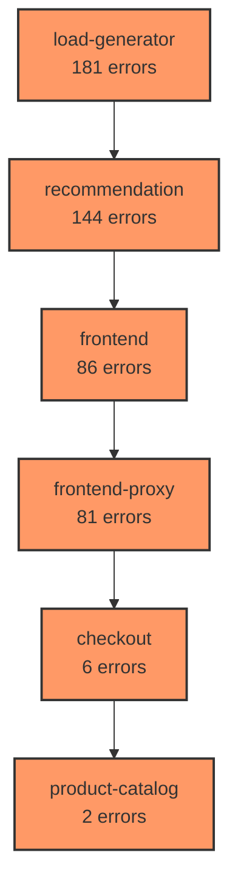

```mermaid
gantt
  dateFormat X
  axisFormat %L ms
  title Distributed Trace Timeline
  %% Trace visualization chart
  section frontend
  GET :active, task_72ce9593, after 0ms, 187ms
  GET /api/products/{productId} :active, task_36fed3a5, after 0ms, 186ms
  executing api route (pages) /api/products/[productId] :active, task_d97a9420, after 0ms, 186ms
  grpc.oteldemo.ProductCatalogService/GetProduct :active, task_2c928057, after 0ms, 186ms
  section load-generator
  GET :active, task_d99ac347, after 0ms, 188ms
  section product-catalog
  oteldemo.ProductCatalogService/GetProduct :active, task_1203c15e, after 0ms, 147ms
```

# OTEL MCP Server

A minimal MCP (Model Context Protocol) server that provides a stdio-based interface to Elasticsearch for querying and analyzing OpenTelemetry (OTEL) observability data (traces, metrics, logs).

## ⚙️ MCP Configuration

To use OTEL MCP Server with tools like MCP Inspector or Windsurf, use the following configuration (assuming default environment variables and that you run the server with `npx -y otel-mcp-server`):

```json
{
   "servers": {
      // ...
      "otel-mcp-server": {
         "command": "npx",
         "args": ["-y", "otel-mcp-server"],
         "env": {
            "ELASTICSEARCH_URL": "http://localhost:9200",
            "ELASTICSEARCH_USERNAME": "elastic",
            "ELASTICSEARCH_PASSWORD": "changeme",
            "SERVER_NAME": "otel-mcp-server",
            "LOGLEVEL": "OFF",
            "LOGFILE": "logs/mcp-requests.log"
         }
      }
      // ...
   }
}
```


## ✨ Features

- **Direct Query** - Execute custom Elasticsearch queries against traces, metrics, and logs
- **Service-Aware Tools** - Filter all tools by service or query across multiple services
- **Field Discovery** - Find available fields for specific services to construct effective queries
- **Structured Error Handling** - All tools return consistent, structured error responses
- **Connection Validation** - Automatic validation on startup
- **Cross-Platform** - Windows, macOS, and Linux
- **Dual Mapping Mode Support** - Compatible with both OTEL and ECS mapping modes in Elasticsearch

## 🔄 Elasticsearch Mapping Modes

The OTEL MCP Server supports two Elasticsearch mapping modes for OpenTelemetry data:

### OTEL Mapping Mode

The `otel` mapping mode preserves the original OpenTelemetry data structure, keeping attribute names and closely following the OTLP event structure. This mode requires Elasticsearch 8.12+ and uses data streams for optimal time series performance.

**Configuration requirements:**
- Elasticsearch 8.12+ or 9.0+
- Data stream index templates for logs, metrics, and traces
- OpenTelemetry Collector configured with:
  ```yaml
  exporters:
    elasticsearch:
      mapping:
        mode: otel
      headers:
        X-Elastic-Mapping-Mode: otel
  ```

### ECS Mapping Mode

The `ecs` mapping mode maps OpenTelemetry fields to the Elastic Common Schema (ECS), making the data more compatible with existing Elastic dashboards and tools.

**Configuration requirements:**
- Works with all Elasticsearch versions
- OpenTelemetry Collector configured with:
  ```yaml
  exporters:
    elasticsearch:
      mapping:
        mode: ecs
      headers:
        X-Elastic-Mapping-Mode: ecs
  ```

The OTEL MCP Server automatically detects and adapts to both mapping modes, so you can use either format without changing your configuration.

## 🚀 Quick Start

1. **Clone and install dependencies**:
   ```bash
   git clone https://github.com/your-username/otel-mcp-server.git
   cd otel-mcp-server
   npm install
   ```

2. **Configure your environment**:
   ```bash
   cp .env.example .env
   # Edit .env with your Elasticsearch details
   ```

3. **Build the server**:
   ```bash
   npm run build
   ```

4. **Start the server** (stdio MCP transport):
   ```bash
   npm start
   ```

## 🛠️ Usage

This server exposes MCP tools for use with MCP-compatible clients (such as Windsurf or MCP Inspector). All tools return structured responses and include consistent error handling.

### 🔧 Available Tools

### Direct Query Tools

- `tracesQuery`: Execute custom Elasticsearch queries against trace data
- `logsQuery`: Execute custom Elasticsearch queries against log data
- `metricsQuery`: Execute custom Elasticsearch queries against metric data

### Field Discovery Tools

- `traceFieldsGet`: Discover available trace fields with their types (supports service filtering)
- `logFieldsGet`: Discover available log fields with their types and schemas (supports service filtering)
- `metricsFieldsGet`: Discover available metric fields with their types (supports service filtering)

### Service Discovery

- `servicesGet`: List all available services and their versions

### Common Query Parameters

All query tools support the following parameters:

- `query`: Elasticsearch query object
- `size`: Maximum number of results to return
- `from`: Starting offset for pagination
- `sort`: Sort order for results
- `aggs`: Aggregation definitions
- `_source`: Fields to include in results (default: true)
- `search`: Simple text search across fields
- `agg`: Simplified aggregation definition
- `runtime_mappings`: Dynamic field definitions
- `script_fields`: Computed fields using scripts

## 🔎 Example Queries

Here are some example queries you can use with the OTEL MCP Server tools:

### Trace Queries

```javascript
// Query for traces with errors in the payment service
mcp0_tracesQuery({
  "query": {
    "query": {
      "bool": {
        "must": [
          { "term": { "service.name": "payment" } },
          { "term": { "status.code": "ERROR" } }
        ]
      }
    },
    "size": 10,
    "sort": [{ "@timestamp": "desc" }]
  }
})
```

### Log Queries

```javascript
// Query for error logs in the checkout service
mcp0_logsQuery({
  "query": {
    "query": {
      "bool": {
        "must": [
          { "term": { "service.name": "checkout" } },
          { "term": { "severity.text": "ERROR" } }
        ]
      }
    },
    "size": 10,
    "sort": [{ "@timestamp": "desc" }]
  }
})
```

### Metric Queries

```javascript
// Query for high CPU usage metrics
mcp0_metricsQuery({
  "query": {
    "query": {
      "bool": {
        "must": [
          { "term": { "metric.name": "system.cpu.usage" } },
          { "range": { "metric.value": { "gt": 0.8 } } }
        ]
      }
    },
    "size": 10,
    "sort": [{ "@timestamp": "desc" }]
  }
})
```

## 🔍 Field Discovery Examples

The field discovery tools help you understand the data structure to build effective queries:

### Trace Field Discovery

```javascript
// Find duration-related trace fields in the checkout service
mcp0_traceFieldsGet({
  "search": "duration",
  "service": "checkout"
})

// Get all trace fields across multiple services
mcp0_traceFieldsGet({
  "services": ["payment", "inventory", "shipping"]
})
```

### Log Field Discovery

```javascript
// Find error-related log fields
mcp0_logFieldsGet({
  "search": "error"
})

// Get log fields specific to the payment service
mcp0_logFieldsGet({
  "service": "payment"
})
```

### Metric Field Discovery

```javascript
// Find CPU-related metric fields
mcp0_metricsFieldsGet({
  "search": "cpu"
})

// Get metric fields across multiple services
mcp0_metricsFieldsGet({
  "services": ["payment", "inventory", "shipping"]
})
```

### Service Discovery

```javascript
// Get all available services
mcp0_servicesGet({})

// Find services matching a pattern
mcp0_servicesGet({
  "search": "payment"
})

```

## 💻 Testing with OpenTelemetry Demo

You can test OTEL MCP Server with the official [OpenTelemetry Demo](https://github.com/open-telemetry/opentelemetry-demo) to ingest and query real traces, metrics, and logs.

### Setup Steps:

1. **Deploy the OpenTelemetry Demo** (via Docker Compose or Kubernetes)
2. **Configure Elasticsearch** as an exporter in the demo
3. **Set environment variables** for OTEL MCP Server to connect to your Elasticsearch instance
4. **Start the OTEL MCP Server** using `npm start` or `npx otel-mcp-server`

### Example Test Queries

```javascript
// Check available services
mcp0_servicesGet({})

// Find available trace fields
mcp0_traceFieldsGet({})

// Query for recent traces
mcp0_tracesQuery({
  "query": {
    "query": { "match_all": {} },
    "size": 10,
    "sort": [{ "@timestamp": "desc" }]
  }
})
```
## 🔎 Error Handling

All tools in the OTEL MCP Server provide structured error responses when issues occur. This makes it easier to diagnose and fix problems programmatically.

### Error Response Format

When an error occurs, tools return a consistent JSON structure:

```json
{
  "error": true,
  "type": "ElasticsearchDataError",
  "message": "Error accessing trace data: index_not_found_exception",
  "params": {
    "query": { /* original query parameters */ }
  }
}
```

This structured approach provides several benefits:

- **Programmatic Error Handling**: Clients can easily parse errors and handle them programmatically
- **Improved Diagnostics**: The detailed error information makes it easier to diagnose and fix issues
- **Consistent User Experience**: All tools handle errors in a consistent way

## 💻 Conclusion

The OTEL MCP Server provides a streamlined approach to querying OpenTelemetry data in Elasticsearch. By focusing on direct query capabilities and field discovery, it offers maximum flexibility while maintaining a simple, consistent interface.

Key advantages:

- **Direct Access**: Transparent access to Elasticsearch data without hiding query complexity
- **Flexibility**: Full control over queries for maximum customization
- **Discovery Support**: Tools to help understand the available data structure
- **Minimal Abstraction**: No high-level abstractions that hide the underlying data model
- **Consistent Error Handling**: Structured error responses across all tools
```

## 🔄 Adaptive Tool Registration

The OTEL MCP Server automatically adapts to the available data in your Elasticsearch instance:

- If trace data is available, trace tools are registered
- If metric data is available, metric tools are registered
- If log data is available, log tools are registered

This ensures that you only see tools that will work with your available data. If a particular telemetry type is not available, the corresponding tools will not be registered, preventing you from attempting to use tools that would fail.

## 💡 Usage Examples

Here are some practical examples of how to use the OTEL MCP Server in real-world scenarios:

### Troubleshooting Service Errors

```
This API endpoint is returning 500 errors. Use the tracesQuery tool to find recent traces for this endpoint, then examine the error details.
```

```javascript
// Find traces with errors in the API service
mcp0_tracesQuery({
  "query": {
    "query": {
      "bool": {
        "must": [
          { "term": { "service.name": "api" } },
          { "term": { "status.code": "ERROR" } },
          { "range": { "@timestamp": { "gte": "now-1h" } } }
        ]
      }
    },
    "size": 10,
    "sort": [{ "@timestamp": "desc" }]
  }
})
```

### Investigating Performance Issues

```
The payment-service is showing high latency. Use the metricsQuery tool to find relevant metrics and identify any resource bottlenecks.
```

```javascript
// Find high-latency metrics for the payment service
mcp0_metricsQuery({
  "query": {
    "query": {
      "bool": {
        "must": [
          { "term": { "service.name": "payment" } },
          { "term": { "metric.name": "http.server.duration" } },
          { "range": { "metric.value": { "gt": 1000 } } }
        ]
      }
    },
    "size": 10,
    "sort": [{ "metric.value": "desc" }]
  }
})
```

## 💬 Contributing

Contributions to the OTEL MCP Server are welcome! If you'd like to contribute:

1. Fork the repository
2. Create a feature branch
3. Make your changes
4. Submit a pull request

## 🔒 License

MIT

---

Built with ❤️ for the OpenTelemetry community
      "maxResults": 10,
      "showData": true
    }
  }
})
```

### Service Health Chart

Time series visualization of service health metrics:

```javascript
// Generate a service health chart for CPU usage
mcp0_generateMarkdownVisualizations({
  "config": {
    "timeRange": {
      "start": "now-6h",
      "end": "now"
    },
    "config": {
      "type": "service-health",
      "services": ["payment", "checkout", "inventory"],
      "metricField": "system.cpu.usage",
      "aggregation": "avg",
      "intervalCount": 12,
      "yAxisLabel": "CPU Usage (%)"
    }
  }
})
```

### Service Dependency Graph

Visualize the relationships and call patterns between services:

```javascript
// Generate a service dependency graph
mcp0_generateMarkdownVisualizations({
  "config": {
    "timeRange": {
      "start": "now-6h",
      "end": "now"
    },
    "config": {
      "type": "service-dependency",
      "query": "Resource.service.name:payment" // Optional: filter to focus on specific services
    }
  }
})
```

**Example Output:**

```mermaid
graph TD
  A["checkout"]
  B["frontend"]
  C["flagd"]
  D["shipping"]
  E["cart"]
  F["currency"]
  G["frontend-proxy"]
  H["payment"]
  I["product-catalog"]
  J["fraud-detection"]
  K["load-generator"]
  L["email"]
  M["recommendation"]
  N["ad"]
  A --> |2 calls| B
  A --> |4 calls| C
  A --> |2 calls| D
  A --> |4 calls| E
  A --> |2 calls| F
  A --> |2 calls| G
  A --> |2 calls| H
  A --> |4 calls| I
  A --> |3 calls| J
  A --> |4 calls| K
  A --> |2 calls| L
  # (Showing partial graph for readability)
```


```javascript
// Generate a service dependency graph
mcp0_generateMarkdownVisualizations({
  "config": {
    "timeRange": {
      "start": "now-24h",
      "end": "now"
    },
    "config": {
      "type": "service-dependency",
      "query": "Resource.service.name:payment OR Resource.service.name:checkout"
    }
  }
})
```

**Example Output:**



### Incident Graph

Visualize the relationships between services during an incident:

```javascript
// Generate an incident graph showing service error relationships
mcp0_generateMarkdownVisualizations({
  "config": {
    "timeRange": {
      "start": "now-30d",
      "end": "now"
    },
    "config": {
      "type": "incident-graph"
      // Optional parameters:
      // "service": "frontend", // Focus on a specific service
      // "query": "level:error" // Filter by query
    }
  }
})
```

**Example Output:**



```javascript
// Generate an incident graph focused on a specific service with a query filter
mcp0_generateMarkdownVisualizations({
  "config": {
    "timeRange": {
      "start": "now-7d",
      "end": "now"
    },
    "config": {
      "type": "incident-graph",
      "service": "frontend", // Focus on the frontend service
      "query": "level:error OR severity:error" // Filter for errors only
    }
  }
})
```

### Span Gantt Chart

Timeline visualization of spans in a distributed trace:

```javascript
// Generate a span gantt chart for a specific span
mcp0_generateMarkdownVisualizations({
  "config": {
    "timeRange": {
      "start": "now-7d",
      "end": "now"
    },
    "config": {
      "type": "span-gantt",
      "spanId": "d97a9420de311bf1", // The span ID to visualize
      "query": "service:frontend" // Optional: filter related spans
    }
  }
})
```

**Example Output:**



```javascript
// Generate a span Gantt chart for a specific trace
mcp0_generateMarkdownVisualizations({
  "config": {
    "timeRange": {
      "start": "now-1h",
      "end": "now"
    },
    "config": {
      "type": "span-gantt",
      "spanId": "abcdef1234567890"
    }
  }
})
```

### Markdown Table

Tabular representation of OTEL data:

```javascript
// Generate a custom markdown table from trace data
mcp0_generateMarkdownVisualizations({
  "config": {
    "timeRange": {
      "start": "now-1h",
      "end": "now"
    },
    "config": {
      "type": "markdown-table",
      "headers": ["Timestamp", "Service", "Operation", "Duration", "Status"],
      "queryType": "traces",
      "query": {
        "match": {
          "Resource.service.name": "payment"
        }
      },
      "fieldMappings": ["@timestamp", "Resource.service.name", "name", "duration", "status.code"],
      "maxRows": 5,
      "alignment": ["left", "left", "left", "right", "center"]
    }
  }
})
```

**Example Output:**

| Timestamp | Service | Operation | Duration | Status |
|:----------|:--------|:----------|--------:|:------:|
| 2025-05-25 19:42:15 | payment | Process Payment | 235ms | OK |
| 2025-05-25 19:41:32 | payment | Validate Card | 45ms | OK |
| 2025-05-25 19:40:18 | payment | Process Payment | 1250ms | ERROR |
| 2025-05-25 19:39:55 | payment | Validate Card | 52ms | OK |
| 2025-05-25 19:38:41 | payment | Process Refund | 187ms | OK |

```javascript
// Generate a markdown table of trace data
mcp0_generateMarkdownVisualizations({
  "config": {
    "timeRange": {
      "start": "now-1h",
      "end": "now"
    },
    "config": {
      "type": "markdown-table",
      "headers": ["Timestamp", "Service", "Operation", "Duration", "Status"],
      "fieldMappings": ["timestamp", "Resource.service.name", "name", "duration", "status.code"],
      "queryType": "traces",
      "query": {},
      "maxRows": 20
    }
  }
})
```

### Metrics Time Series Table

Tabular representation of metrics over time intervals:

```javascript
// Generate a metrics time series table
mcp0_generateMarkdownVisualizations({
  "config": {
    "timeRange": {
      "start": "now-3h",
      "end": "now"
    },
    "config": {
      "type": "metrics-time-series-table",
      "metricField": "system.cpu.usage",
      "services": ["payment", "checkout", "inventory"],
      "intervalCount": 6,
      "formatValue": "decimal2",
      "query": "name:system.cpu.usage"
    }
  }
})
```

**Example Output:**

| Service | 17:00 | 17:30 | 18:00 | 18:30 | 19:00 | 19:30 |
|---------|-------|-------|-------|-------|-------|-------|
| payment | 45.32 | 48.75 | 52.18 | 87.95 | 92.33 | 65.47 |
| checkout | 32.15 | 35.42 | 38.67 | 42.18 | 40.25 | 38.92 |
| inventory | 28.75 | 30.12 | 32.45 | 35.18 | 33.92 | 31.47 |

```javascript
// Generate a metrics time series table
mcp0_generateMarkdownVisualizations({
  "config": {
    "timeRange": {
      "start": "now-6h",
      "end": "now"
    },
    "config": {
      "type": "metrics-time-series-table",
      "metricField": "system.memory.usage",
      "services": ["payment", "checkout", "inventory"],
      "intervalCount": 6,
      "formatValue": "decimal2"
    }
  }
})
```

### Incident Analysis

Analyze incidents across multiple services:

```javascript
// Extract an incident graph spanning multiple services
mcp0_extractIncidentGraph({
  "startTime": "2025-05-23T13:00:00-04:00",
  "endTime": "2025-05-23T14:00:00-04:00",
  "services": ["payment", "checkout", "inventory"]
})
```

### Example: Query a Specific Trace

Request:
```json
{
  "tool": "tracesQuery",
  "params": {
    "query": {
      "query": {
        "term": {
          "trace.id": "<your-trace-id>"
        }
      },
      "size": 100
    }
  }
}
```

Response:
```json
{
  "hits": {
    "total": { "value": 12 },
    "hits": [
      {
        "_source": {
          "trace.id": "<your-trace-id>",
          "span.id": "...",
          "service.name": "...",
          "span.name": "...",
          "span.kind": "...",
          "span.duration": 123456,
          "span.status.code": "OK"
        }
      },
      // ... more spans
    ]
  }
}
```

## 🧪 Testing with the OTEL Demo

You can test OTEL MCP Server with the official [OpenTelemetry Demo](https://github.com/open-telemetry/opentelemetry-demo) to ingest and query real traces, metrics, and logs.

### Steps:
1. **Deploy the OTEL Demo** (e.g., via Docker Compose or Kubernetes)
2. **Ensure Elasticsearch security is disabled** in your OTEL demo deployment
3. **Configure your `.env`** for OTEL MCP Server:
   ```env
   ELASTICSEARCH_URL=http://localhost:9200
   # No authentication needed with security disabled
   SERVER_NAME=otel-mcp-server
   LOGLEVEL=info
   ```
4. **Run OTEL MCP Server** and connect your MCP client (e.g., Windsurf)

### ⚠️ Elasticsearch Security Configuration

For development and testing purposes, we've disabled SSL and security in Elasticsearch to simplify connectivity:

#### **Development Setup:**
- We've configured Elasticsearch with security features disabled
- This allows direct HTTP connections without SSL/TLS verification issues
- No need for proxies or complex authentication in development environments

#### **Configuration:**
- Set `ELASTICSEARCH_URL` to the direct HTTP endpoint of your Elasticsearch instance
- For the OTEL demo, this is typically `http://localhost:9200` or the appropriate service endpoint
- No authentication credentials are required with security disabled

```env
ELASTICSEARCH_URL=http://localhost:9200
# No username/password needed with security disabled
```

**Note:** For production environments, you should enable Elasticsearch security features and implement proper authentication and encryption. The current setup is optimized for development ease of use.

If you encounter connection issues, check the logs for error details. Most connection problems can be resolved by ensuring Elasticsearch security features are properly disabled in your development environment.

## 🚢 Deployment & Orchestration Notes

**Note:** OTEL MCP Server is a stdio-based process. It is not meant to be deployed as a long-running HTTP/gRPC service. Instead, it should be launched by an MCP-compatible orchestrator (such as Windsurf, MCP Inspector, or another MCP tool) or run directly in your shell for local testing.

- For most use cases, run the server locally with:
  ```bash
  npm start
  ```
- If containerizing, run it as a foreground process and connect its stdio to your orchestrator.
- Do **not** deploy as a background service or expose as an HTTP endpoint (unless you have added a transport for that purpose).

### Error Handling

The server implements structured error handling for all tools. If a tool encounters an error, it will return a response with the following structure:

```json
{
  "error": true,
  "type": "ErrorType",
  "message": "Detailed error message",
  "params": {
    // Original parameters that caused the error
  }
}
```

This makes it easier to debug issues and provide meaningful feedback to users.

### Kubernetes (Helm or kubectl)
1. **Deploy the OTEL Demo:**
   - Follow the [OpenTelemetry Demo](https://github.com/open-telemetry/opentelemetry-demo) instructions for Kubernetes.
2. **Deploy the Nginx Proxy:**
   - Apply the provided `demo/elasticsearch-nginx-proxy.yaml`:
     ```bash
     kubectl apply -f demo/elasticsearch-nginx-proxy.yaml
     ```
   - Confirm the service is running (default port 80).
3. **Run OTEL MCP Server:**
   - Start the server as a stdio process from your shell, or as a subprocess of your MCP client/orchestrator (e.g., Windsurf):
     ```bash
     npm start
     # or
     node dist/server.js
     ```
   - Set `ELASTICSEARCH_URL` to the Nginx proxy service (e.g., `http://elasticsearch-nginx-proxy:80`).
   - If running in a container, ensure stdio is connected to your orchestrator.

### Docker Compose
1. **Run the OTEL Demo:**
   - Use the official Docker Compose setup from the [OpenTelemetry Demo](https://github.com/open-telemetry/opentelemetry-demo).
2. **Add the Nginx Proxy:**
   - Add a service to your `docker-compose.yaml` referencing the `demo/elasticsearch-nginx-proxy.conf` as a config/volume.
   - Link the proxy to the Elasticsearch container and expose it on a desired port (e.g., 8082).
3. **Run OTEL MCP Server:**
   - Start the server as a stdio process from your shell, or as a subprocess of your MCP client/orchestrator:
     ```bash
     npm start
     # or
     node dist/server.js
     ```
   - Set `ELASTICSEARCH_URL` to the Nginx proxy (e.g., `http://nginx-proxy:8082`).
   - If running in a container, ensure stdio is connected to your orchestrator.

**See the `demo/` directory for ready-to-use config files for both Kubernetes and Docker Compose.**

### Examples

1. Query for traces:
   ```json
   {
     "tool": "tracesQuery",
     "params": {
       "query": {
         "query": {
           "range": {
             "@timestamp": {
               "gte": "2023-01-01T00:00:00Z",
               "lte": "2023-01-02T00:00:00Z"
             }
           }
         },
         "size": 10
       }
     }
   }
   ```

2. Search for trace fields:
   ```json
   {
     "tool": "traceFieldsGet",
     "params": {
       "search": "duration"
     }
   }
   ```

3. Search for log fields:
   ```json
   {
     "tool": "logFieldsGet",
     "params": {
       "search": "message"
     }
   }
   ```

4. Find available metric fields:
   ```json
   {
     "tool": "metricsFieldsGet",
     "params": {
       "search": "cpu"
     }
   }
   ```

5. Query metrics data:
   ```json
   {
     "tool": "metricsQuery",
     "params": {
       "query": {
         "query": { "match_all": {} },
         "size": 10,
         "sort": [{ "@timestamp": "desc" }]
       }
     }
   }
   ```

6. List all services:
   ```json
   {
     "tool": "servicesGet",
     "params": {}
   }
   ```

## 🔍 Debugging

Set the `DEBUG=1` environment variable to enable detailed logging:

```bash
DEBUG=1 npm start
```

This will show:
- Request/response headers
- Full request/response bodies
- Elasticsearch query details
- Error stack traces

## 🔎 Error Handling

All tools return structured error responses when issues occur. For example:

```json
{
  "error": true,
  "type": "ElasticsearchDataError",
  "message": "Error accessing trace data: index_not_found_exception",
  "params": {
    "query": { "match_all": {} }
  }
}
```
- Detailed error messages
- Connection details

## 🤝 Contributing

Contributions to the OTEL MCP Server are welcome! If you'd like to contribute:

1. Fork the repository
2. Create a feature branch
3. Make your changes
4. Submit a pull request

## 📝 License

This project is licensed under the MIT License - see the [LICENSE](LICENSE) file for details.

## Integration

You can pipe commands to the server:
```bash
echo "query traces '{\"timeRange\": {\"start\": \"2023-01-01T00:00:00Z\", \"end\": \"2023-01-02T00:00:00Z\"}}'" | npm start
```

## Example Prompts for LLMs

Here are some example prompts you can use with LLMs that have access to this MCP server:

### Exploring Data Structure

```
What fields are available in the trace data? Use the traceFieldsGet tool to find out.
```

```
I want to analyze logs related to errors. What fields should I look at? Use the logFieldsGet tool to find fields related to errors or exceptions.
```

```
What metrics are available for the 'frontend' service? Use the metricsFieldsGet tool to find relevant metric fields for this service.
```

### Service Discovery

```
What services are available in the system? Use the servicesGet tool to list all services.
```

```
Are there any services related to payment processing? Use the servicesGet tool with a search parameter.
```

### Troubleshooting

```
Find all error traces from the last 24 hours for the 'payment' service. Use the tracesQuery tool with a bool query.
```

```
Show me the most recent logs from the 'checkout' service. Use the logsQuery tool with appropriate filters.
```

```
Get the CPU usage metrics for the 'api' service over the past hour. Use the metricsQuery tool to query the relevant data.
```

### Incident Investigation

```
Query the traces during the outage period between 2:00 PM and 3:00 PM today. Focus on the 'authentication' service and look for error status codes.
```

```
Use the logsQuery tool to find logs with error severity during the incident timeframe (May 23, 2025, 10:00-11:00 AM).
```

```
Query the logs during the incident and look for any authentication failures or timeout errors using the logsQuery tool with a bool query.
```

## Windsurf-Specific Prompts with Code Context

When using this MCP server with [Windsurf](https://windsurf.com/editor), you can leverage both telemetry data and code context for more powerful analysis. Here are some prompts designed specifically for Windsurf:

### Exploring Code and Data Together

```
What fields are available in our trace data that correspond to the error handling in our API controllers? Use the traceFieldsGet tool to find relevant fields, then show me where these are used in our code.
```

```
How do our database query metrics correlate with our ORM implementation? Use metricsFieldsGet to find database metrics, then analyze our database access patterns in the code.
```

### Performance Analysis

```
Use the tracesQuery tool to find slow traces in our payment processing service, then help me analyze the corresponding code to identify performance bottlenecks.
```

```
Query the metrics data for CPU and memory usage patterns during peak load times, then correlate this with our resource allocation in the code.
```

### Code-Aware Troubleshooting

```
I'm seeing errors in the authentication service. Use the logsQuery tool to find recent authentication errors, then analyze the relevant code in our codebase to identify potential issues. Focus on the auth middleware and token validation logic.
```

```
This API endpoint is returning 500 errors. Use the tracesQuery tool to find recent traces for this endpoint, then examine the code to identify what might be causing the failures. Look for error handling, database queries, and external service calls.
```

```
The 'payment-service' is showing high latency. Use the metricsFieldsGet tool to find relevant metrics, then analyze the performance of our payment processing code. Identify any inefficient algorithms, blocking calls, or resource bottlenecks.
```

### Root Cause Analysis

```
We had an incident yesterday between 2:00-3:00 PM. Use the tracesQuery and logsQuery tools to analyze the data from this time period, then correlate the affected services with our codebase. Identify which code changes might have contributed to the issue and suggest fixes.
```

```
This trace ID shows a failed checkout: <trace-id>. Use the tracesQuery tool to retrieve this trace and then examine our checkout flow code to determine what went wrong. Suggest code improvements to prevent this issue in the future.
```

### Performance Optimization

```
Our database queries are slow according to the traces. Use the tracesQuery tool to find the slowest database operations, then analyze our database access code and suggest optimizations. Look for missing indexes, N+1 queries, or inefficient joins.
```

```
Use the metricsQuery tool to find unusual patterns in our API response times across all services, then review the API implementation code to identify potential performance bottlenecks. Focus on metrics with high values.
```

```
Find slow spans in our payment and checkout services for the last hour using the tracesQuery tool with appropriate filters. Then suggest code improvements for the slowest operations.
```

### Error Pattern Detection

```
Use the logsQuery tool with aggregations to find unusual log patterns in our payment service over the last 2 hours. Focus on error frequency and patterns. Analyze the results to identify potential issues and suggest fixes.
```

```
Analyze error patterns across our microservices using the logsQuery tool with appropriate filters and aggregations. Then examine our error handling code to identify common failure modes and suggest improvements to our error handling and resilience patterns.
```

```
Use the logFieldsGet tool to find all available log fields for our authentication service, then use those fields with the logsQuery tool to search for authentication failures during the incident timeframe (May 23, 2025, 1:00-2:00 PM).
```

```
Use the tracesQuery and logsQuery tools to analyze the incident data across our payment, checkout, and inventory services. Identify which services were most affected and suggest areas to investigate further.
```

### Cross-Service Analysis

```
Perform a comprehensive analysis of our checkout flow by:
1. Using metricsFieldsGet to find all available metric fields for the checkout service
2. Using metricsQuery to analyze those metrics for unusual patterns
3. Using logsQuery to search for error patterns in the checkout service logs
4. Using tracesQuery to analyze slow spans in the checkout process
Then provide a summary of potential issues and recommendations.
```

```
Compare the performance of our payment service before and after the recent deployment. Use the metricsQuery and tracesQuery tools to identify any regressions or improvements. Focus on both the payment service itself and any services it depends on.
```

```
Use the logsQuery tool with appropriate aggregations to find unusual patterns across our entire system during the incident window. Group the results by service and focus on the most severe errors.
```

## Building for Production

To build the TypeScript code to JavaScript:
```bash
npm run build
```

The built files will be in the `dist` directory.
