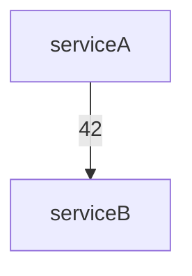

# tools/

This directory contains modular tool classes for OTEL MCP Server, separated by resource type and function. Each tool class encapsulates logic for a specific set of operations (traces, logs, metrics, AI, etc.) and depends on the ElasticsearchAdapter.

- otelTraces.ts — Trace and span analysis, dependency graphs
- otelLogs.ts   — Log search, error aggregation
- otelMetrics.ts — Metric queries, aggregations
- incidentGraph.ts — Incident subgraph extraction with Mermaid output
- anomalyDetection.ts — Metric anomaly detection
- logAnomalyDetection.ts — Log anomaly detection using hybrid approach

## Graph Visualization with Mermaid

Both the service dependency graph and incident graph tools return a `mermaid` field in their output, containing a Mermaid flowchart string for easy visualization:

````markdown

````

## Anomaly Detection

### Metric Anomaly Detection

The metric anomaly detection tool (`anomalyDetection.ts`) flags time buckets in metrics where the value is an outlier (mean + N*stddev). Register and use as an MCP tool.

### Log Anomaly Detection

The log anomaly detection tool (`logAnomalyDetection.ts`) implements a hybrid approach for detecting anomalous logs without requiring machine learning models. It combines multiple detection strategies:

1. **Frequency-based detection** - Identifies unusual spikes or drops in log volume compared to a baseline period
2. **Pattern-based detection** - Searches for logs containing error patterns or unexpected severity changes
3. **Statistical outlier detection** - Flags logs with unusual field values based on statistical measures
4. **Clustering and cardinality analysis** - Detects unusual groupings or unexpected variety in log messages

The tool supports filtering by service and provides configurable parameters for fine-tuning detection sensitivity. Results are grouped by service when analyzing multiple services.

## Extending Tools

To add new tools, create a new file in `src/tools/`, implement your class, and register its methods as MCP tools in `server.ts`.
